<div align="center">



</div>

# TRIAD — Drone & Autonomous Systems Ecosystem

Hệ sinh thái phương tiện tự hành và điều khiển bay **TRIAD** (UAV / USV) phát triển bởi **Cinq (Nguyễn Trung) — ReShape Lab**.

Kho mã nguồn này chứa firmware điều khiển trung tâm đa vi điều khiển (**ESP32, ESP32-S3, STM32F103**) cho quadcopter, tay cầm điều khiển và trợ lý robot.

---

## 🧭 Các môi trường PlatformIO (Environments)

| Môi trường (Env) | Vi điều khiển | Tệp nguồn chính | Vai trò kỹ thuật |
| :--- | :--- | :--- | :--- |
| `esp32_drone` | ESP32 DevKit V1 | [`src/main_esp32.cpp`](src/main_esp32.cpp) | Đọc IMU BNO08x, GPS, nhận RC qua ESP-NOW, xuất DShot 4 ESC, telemetry |
| `stm32_drone` | STM32F103 Blue Pill | [`src/main_stm32f103c8t6.cpp`](src/main_stm32f103c8t6.cpp) | Cascade PID + motor mixer, nhận RC dự phòng qua NRF24 |
| `esp32_controller` | ESP32 DevKit V1 | [`src/main_esp32_controler.cpp`](src/main_esp32_controler.cpp) | Tay cầm điều khiển 2 joystick, màn hình TFT + OLED, âm thanh I2S |
| `esp32s3_xiaozhi` | WeAct ESP32-S3 N16R8 | [`src/main_xiaozhi.cpp`](src/main_xiaozhi.cpp) | Màn hình GMT147SPI, Mic INMP441, Loa MAX98357A, ToF, 4x Servo |

---

## ⚡ Hướng dẫn nạp Firmware

```bash
# Nạp firmware cho Drone ESP32
pio run -e esp32_drone -t upload

# Nạp firmware cho STM32 Blue Pill (qua ST-Link)
pio run -e stm32_drone -t upload

# Nạp firmware tay cầm điều khiển
pio run -e esp32_controller -t upload

# Nạp firmware trợ lý robot Xiaozhi trên ESP32-S3
pio run -e esp32s3_xiaozhi -t upload
```

---

## 📑 Tài liệu đấu nối & Thiết kế

- **Sơ đồ đấu nối Drone**: Chi tiết tại [`docs/DRONE_WIRING.md`](docs/DRONE_WIRING.md).
- **Sơ đồ đấu nối Tay cầm (Controller)**: Chi tiết tại [`docs/CONTROLLER_WIRING.md`](docs/CONTROLLER_WIRING.md).
- **Thiết kế Vi mạch (IC Design PID)**: Chi tiết tại [`ic/README.md`](ic/README.md).
- **Dự án Xiaozhi Robot độc lập**: [gwaen-jung/esp32s3_weact_xiaozhirobot](https://github.com/gwaen-jung/esp32s3_weact_xiaozhirobot).

---

<div align="center">
  <sub>Developed by <b>Cinq / ReShape Lab</b> • Autonomous Vehicles & Embedded Systems</sub>
</div>
