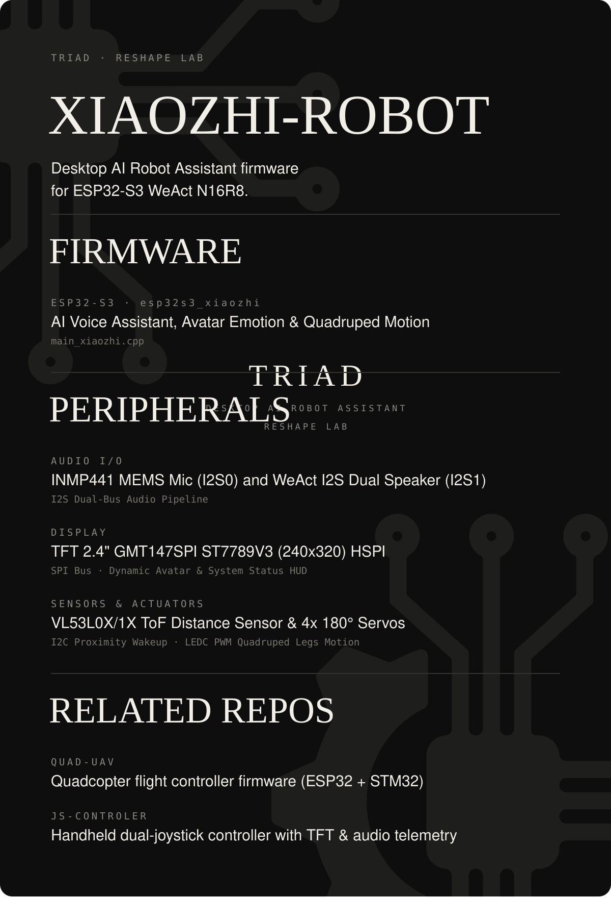

<div align="center">



</div>

# XIAOZHI-ROBOT

Firmware trợ lý AI để bàn **Xiaozhi Desktop Robot** phát triển trên nền tảng vi điều khiển **ESP32-S3 WeAct CoreBoard N16R8** (16MB Flash, 8MB PSRAM OPI). 

Robot tích hợp tương tác giọng nói 2 chiều (Micro MEMS INMP441 + Khuếch đại WeAct I2S Dual Speaker & Loa 4 Ohm), màn hình **TFT 2.4" GMT147SPI (ST7789V3)** hiển thị avatar/biểu cảm động và logo boot ReShape Lab, cảm biến quang học ToF **VL53L0X / VL53L1X** nhận diện người lại gần, cùng hệ thống **4 động cơ Servo 180°** điều khiển 4 chân di chuyển (Quadruped robot). Hệ thống được trang bị nút nguồn mềm (Soft Power / Wake up) ở chân KEY (GPIO45) và BOOT, cùng LED WS2812 ở GPIO48 phản hồi cảm xúc (Mood).

| Môi trường (Env) | Bo mạch MCU | Vai trò kỹ thuật | Lệnh nạp firmware |
| :--- | :--- | :--- | :--- |
| `esp32s3_xiaozhi` | WeAct ESP32-S3-A N16R8 | Firmware chính robot Xiaozhi | `pio run -e esp32s3_xiaozhi -t upload` |

```bash
# Biên dịch và nạp firmware qua cổng Type-C Native
pio run -e esp32s3_xiaozhi -t upload

# Mở serial monitor (115200 baud)
pio device monitor -b 115200
```

---

## 🛠 Danh mục Linh kiện (Hardware BOM)

| Cụm chức năng | Linh kiện | Giao tiếp | Vai trò trong Robot | Ghi chú kỹ thuật |
| :--- | :--- | :--- | :--- | :--- |
| **Xử lý trung tâm** | WeAct ESP32-S3 CoreBoard | — | Chạy FreeRTOS, xử lý Audio/WiFi, điều khiển ngoại vi | Bản A (N16R8: 16MB Flash, 8MB PSRAM OPI) |
| **Màn hình biểu cảm** | TFT GMT147SPI 2.4" | SPI (HSPI) | Hiển thị mắt biểu cảm, cử động miệng, HUD thông số | Chip ST7789V3 240x320 IPS |
| **Micro thu âm** | INMP441 MEMS | I2S (I2S0) | Thu giọng nói người dùng gửi lên server STT/LLM | Micro kỹ thuật số 24-bit |
| **Phát âm thanh** | WeAct I2S Dual Speaker | I2S (I2S1) | Khuếch đại âm thanh ra Loa 4 Ohm | Mạch DAC/Amp chuẩn I2S, âm thanh lớn |
| **Cảm biến khoảng cách**| VL53L0X / VL53L1X v2 | I2C | Nhận diện người lại gần, nhận diện cử chỉ vẫy tay | Cảm biến ToF đo khoảng cách bằng laser |
| **Cơ cấu cử động** | 4× Servo 180° | PWM (LEDC) | Điều khiển 4 chân di chuyển (Quadruped) | Tần số 50Hz, góc quay 0° – 180° |
| **Nguồn & Ổn áp** | Mạch Boost DC/DC (Tăng áp) | Nguồn xung | Tăng áp từ pin 1S2P (3.7V) lên 5.0V 3A cấp cho Servo & ESP32 | Chịu dòng đỉnh cao |
| **Tương tác & Cảm xúc** | Nút bấm & LED WS2812 | GPIO | Soft Power (Wake/Sleep) bằng nút BOOT & KEY (IO45), Mood LED (IO48) | Tích hợp sẵn trên board WeAct |

---

## 🔌 Sơ đồ đấu nối chân WeAct ESP32-S3-A

Vị trí chân thực tế trên board WeAct ESP32-S3 CoreBoard (Bản A):

```
                             ┌───────────────────┐
                       3.3V ─┤ 3V3           GND ├─ GND
                        EN  ─┤ EN             44 ├─ (UART0 RX)
          MIC_WS (INMP441)  ─┤ 4              43 ├─ (UART0 TX)
          MIC_SCK(INMP441)  ─┤ 5              42 ├─ TFT_MISO (HSPI)
          MIC_SD (INMP441)  ─┤ 6              41 ├─ TFT_MOSI (HSPI)
          TOF_SDA (VL53L0X) ─┤ 7              40 ├─ TFT_SCLK (HSPI)
          TOF_SCL (VL53L0X) ─┤ 8              39 ├─ TFT_CS (HSPI)
               SERVO_1_PAN  ─┤ 9              38 ├─ TFT_DC
              SERVO_2_TILT  ─┤ 10             37 ├─ (PSRAM OPI - Cam dung)
              SERVO_3_ARM_L ─┤ 11             36 ├─ (PSRAM OPI - Cam dung)
              SERVO_4_ARM_R ─┤ 12             35 ├─ (PSRAM OPI - Cam dung)
             SPK_BCLK (MAX) ─┤ 15              0 ├─ BOOT Button
              SPK_LRC (MAX) ─┤ 16             45 ├─ (Strapping - Cam dung)
              SPK_DIN (MAX) ─┤ 17             48 ├─ WS2812 RGB LED Onboard
              SPK_SD  (MAX) ─┤ 18             47 ├─ TFT_RST
               USB D-       ─┤ 19             21 ├─ (Du phong GPIO)
               USB D+       ─┤ 20             14 ├─ (Du phong GPIO)
                        5V  ─┤ 5V             13 ├─ (Du phong GPIO)
                             └───────────────────┘
                                     [USB-C]
```

### Bảng tra cứu chân chi tiết

| Cụm thiết bị | Chân linh kiện | Chân ESP32-S3 | Điện áp | Ghi chú kỹ thuật |
| :--- | :--- | :--- | :--- | :--- |
| **Màn hình TFT ST7789V3** | VCC & BLK | 3V3 | 3.3V | Lấy nguồn 3.3V, BLK nối thẳng 3.3V |
| | GND | GND | 0V | |
| | SCLK | **GPIO 40** | 3.3V | SPI3 (HSPI) Clock |
| | MOSI (SDA) | **GPIO 41** | 3.3V | SPI3 (HSPI) MOSI |
| | CS | **GPIO 39** | 3.3V | SPI3 (HSPI) Chip Select |
| | DC | **GPIO 38** | 3.3V | Data/Command |
| | RST | **GPIO 47** | 3.3V | Reset |
| **Micro INMP441** | VDD | 3V3 | 3.3V | Không cấp 5V |
| | GND | GND | 0V | |
| | SCK | **GPIO 15** | 3.3V | I2S0 Bit Clock |
| | WS  | **GPIO 16** | 3.3V | I2S0 Word Select (LRCK) |
| | SD  | **GPIO 17** | 3.3V | I2S0 Serial Data In |
| | L/R | GND | 0V | Kéo xuống GND để thu kênh trái |
| **WeAct I2S Dual Speaker** | VIN | **5V Boost** | 5.0V | **Cấp 5V từ mạch Boost** để kéo loa 4 Ohm |
| | GND | GND | 0V | |
| | BCLK | **GPIO 12** | 3.3V | I2S1 Bit Clock |
| | LRC  | **GPIO 13** | 3.3V | I2S1 Word Select |
| | DIN  | **GPIO 14** | 3.3V | I2S1 Data Out |
| | SD_MODE | **GPIO 18** | 3.3V | Mute/Shutdown control |
| **ToF VL53L0X/1X** | VIN | 3V3 | 3.3V | Cảm biến chạy 3.3V |
| | GND | GND | 0V | |
| | SDA | **GPIO 8** | 3.3V | I2C Data |
| | SCL | **GPIO 9** | 3.3V | I2C Clock |
| **4× Servo 180° (Chân)** | VCC (Đỏ) | **5V Boost** | 5.0V | **Tuyệt đối không lấy từ 3.3V của ESP32** |
| | GND (Nâu/Đen) | GND | 0V | Nối mass chung về trạm nguồn |
| | Signal (Vàng/Cam) | **GPIO 4, 5, 6, 7** | 3.3V | Điều khiển xung PWM cho 4 chân |
| **Phím / LED (Cảm xúc)** | Nút KEY (Soft Power)| **GPIO 45** | 3.3V | Nút nhấn người dùng tích hợp trên board |
| | Nút BOOT (Dự phòng) | **GPIO 0** | 3.3V | Phím nguồn dự phòng, Active Low |
| | Status LED (Mood) | **GPIO 48** | 3.3V | LED WS2812 đồng bộ màu và thở theo biểu cảm Xiaozhi |

> [!NOTE]
> Cần tuân thủ phân tách 2 bus I2S riêng biệt trên ESP32-S3: **I2S0** dành cho Microphone thu âm (INMP441) và **I2S1** dành cho Speaker phát âm thanh (MAX98357A) để tránh nghẽn xung nhịp và nhiễu tín hiệu.

---

## ⚡ Kiến trúc Nguồn & Chống nhiễu Audio

1. **Dòng tải đỉnh (Peak Current)**:
   - ESP32-S3 phát WiFi + WebSocket: ~350mA.
   - Mạch WeAct I2S Dual Speaker + Loa 4 Ohm: ~500mA - 800mA đỉnh ở 5V.
   - 4 Servo chuyển động đồng thời: Mỗi servo ăn dòng đỉnh 300mA – 600mA ➔ **Tổng 4 servo đỉnh từ 1.5A đến 2.4A!**
   - **Tổng dòng đỉnh toàn hệ thống: ~2.5A – 3.5A ở 5V.**
   - *Khuyến cáo*: Cấp nguồn bằng pin Li-ion ghép song song **1S2P (3.7V, dung lượng cao > 1000mAh)** qua mạch **Boost DC/DC (Tăng áp lên 5V 3A)** kèm mạch sạc Type-C (như TP4056 / IP5306). 

2. **Chống nhiễu âm thanh (Star Grounding & Tụ lọc)**:
   - Động cơ chổi than trong servo khi quay sẽ sinh ra tia lửa điện và xung gai dội ngược về đường mass, gây tiếng rè/sôi loa hoặc lỗi micro.
   - **Tụ bù sụt áp**: Hàn song song **1 tụ hóa 470µF – 1000µF (10V/16V)** ngay tại trạm cấp nguồn 5V của mạch Boost ra 4 servo.
   - **Nối mass hình sao (Star Grounding)**: Dây mass GND từ ngõ ra của module Boost phải chia thành 2 nhánh độc lập:
     - *Nhánh 1*: Chạy thẳng về chân GND của 4 Servo.
     - *Nhánh 2*: Chạy về chân GND của ESP32, màn hình, Micro và Loa.
     - *Không đi dây GND nối tiếp (daisy-chain) qua cụm servo rồi mới về micro/loa*.

```
 [ Pin Lipo 1S2P (3.7V - 4.2V Dung lượng cao) ]
                        │
                        ▼
         ┌───────────────────────────────┐
         │  Mạch Boost Tăng áp (5V 3A)   │
         └──────────────┬────────────────┘
                        │ Đường nguồn 5.0V (Dây lớn >= 22AWG)
            ┌───────────┴───────────┐
            │                       │
            ▼                       ▼
   ┌─────────────────┐     ┌────────────────────────┐
   │ Chân 5V ESP32-S3 │     │ VCC (+) 4 Động cơ Servo │
   │ (Nuôi MCU + TFT) │     │ (Dong khoi dong > 1.5A)│
   └─────────────────┘     └────────────────────────┘
            │                       │
            └───────────┬───────────┘
                        ▼
                 [ GND Chung ]
```

---

## ⚠️ Lưu ý Phần cứng ESP32-S3 WeAct (Gotchas)

- **Chân cấm sử dụng**:
  - `GPIO 0, 3, 45, 46`: Chân cấu hình khởi động (Strapping pins).
  - `GPIO 19, 20`: Kênh USB D- / D+ Native (dùng để nạp firmware và in Serial CDC).
  - `GPIO 35, 36, 37`: Kết nối trực tiếp với chip PSRAM OPI 8MB bên trong module. Không được cấu hình làm GPIO thường.
- **Cờ biên dịch màn hình**: Màn hình OLED SSD1306 dùng chung bus I2C với cảm biến ToF, hãy đảm bảo khởi tạo đúng cấu hình I2C cho thư viện Adafruit SSD1306.
- **Lỗi font OLED**: Khi dùng Adafruit GFX, lưu ý chọn font phù hợp để hiển thị số và chữ to nếu cần (VD: `FreeSans9pt7b`).

---

## 🗺 Lộ trình Phát triển (Development Roadmap)

- [x] **Phase 1: Display & UI Engine**: Khởi tạo màn hình TFT ST7789V3, render ReShape Logo animation, thanh HUD stats và dải Marquee chạy chữ.
- [ ] **Phase 2: I2S Audio Bring-up**: Kiểm tra thu âm micro INMP441 và phát âm thanh qua I2S Dual Speaker 4 Ohm.
- [ ] **Phase 3: Sensor & Servo Integration**: Đọc khoảng cách từ VL53L0X/1X, tạo thuật toán Inverse Kinematics (IK) đơn giản điều khiển 4 chân di chuyển (Quadruped gait).
- [ ] **Phase 4: Xiaozhi Cloud AI Protocol**: Tích hợp giao thức WebSocket / MQTT kết nối server Xiaozhi (STT, LLM, TTS Opus streaming).
- [x] **Phase 5: Emotional Features**: LED WS2812 đồng bộ nhịp thở/cảm xúc, Nút nguồn mềm Deep Sleep (KEY IO45 / BOOT IO0).

---

## 🔗 Liên kết Hệ sinh thái (Related Repos)

Dự án Xiaozhi Robot là một thành phần trong hệ sinh thái điều khiển nhúng **TRIAD / ReShape Lab**:

* **[QUAD-UAV](https://github.com/trungnguyenhpa-cpu/QUAD-UAV)**: Firmware điều khiển bay Quadcopter phối hợp ESP32 (Flight Link) và STM32F103 (Cascade PID).
* **[JS-CONTROLER](https://github.com/trungnguyenhpa-cpu/JS-CONTROLER)**: Firmware tay cầm điều khiển 2 joystick, màn hình kép TFT & OLED, âm thanh I2S.
* **[DRONE_TEST](https://github.com/gwaen-jung/DRONE_TEST)**: Workspace tổng hợp phát triển firmware và kiểm thử phần cứng.

---

<div align="center">
  <sub>Developed by <b>Cinq / ReShape Lab</b> • Robotics &amp; Autonomous Systems</sub>
</div>
