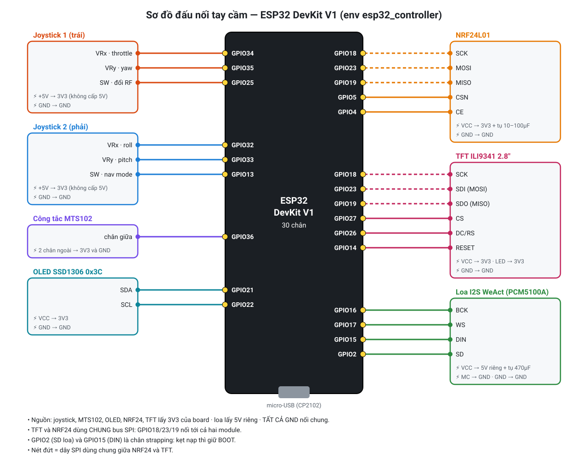
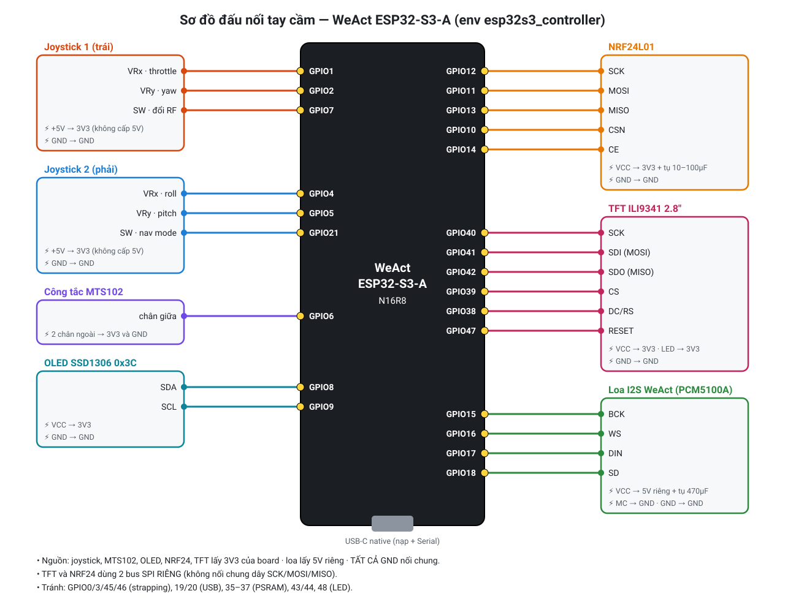

# Sơ đồ đấu nối tay cầm điều khiển

Firmware: [`src/main_esp32_controler.cpp`](../src/main_esp32_controler.cpp)

| Board | Env PlatformIO | Lệnh nạp |
|---|---|---|
| ESP32 DevKit V1 (30 chân) — **bản chính** | `esp32_controller` | `pio run -e esp32_controller -t upload` |
| WeAct ESP32-S3-A N16R8 — bản dự phòng | `esp32s3_controller` | `pio run -e esp32s3_controller -t upload` |

Hai env dùng **chung một mã nguồn**, chỉ khác số chân (xem `build_flags` của `esp32s3_controller` trong `platformio.ini`).

## Linh kiện

| Linh kiện | Giao tiếp | Ghi chú |
|---|---|---|
| 2 × joystick analog (VRx, VRy, SW) | ADC + GPIO | J1 = throttle/yaw, J2 = roll/pitch |
| Công tắc gạt MTS102 | GPIO | Bật = menu cài đặt, tắt = dashboard |
| NRF24L01 | SPI | Kênh RF dự phòng (giữ SW của J1 5 giây để chuyển ESP-NOW ↔ NRF24) |
| TFT ILI9341 2.8" 320×240 | SPI | Dashboard chính |
| OLED SSD1306 128×64 | I2C, địa chỉ 0x3C (nhãn 0x78) | Thông số phụ |
| WeAct I2S Speaker V1 (PCM5100A + class-D) | I2S | Giọng nói thông báo, loa 4Ω |

## ESP32 DevKit V1



Vị trí chân thật trên board:

```
                        ┌──────────────────────┐
                        │      ESP32 DevKit V1 │
                        │        (ăng-ten)     │
                   EN ──┤                      ├── D23 ── MOSI (TFT + NRF24)
       MTS102 ──── VP36 ┤                      ├── D22 ── OLED SCL
                   VN39 ┤                      ├── TX0
   J1 VRx (thr) ── D34 ─┤                      ├── RX0
   J1 VRy (yaw) ── D35 ─┤                      ├── D21 ── OLED SDA
   J2 VRx (roll)── D32 ─┤                      ├── D19 ── MISO (TFT + NRF24)
   J2 VRy (pit) ── D33 ─┤                      ├── D18 ── SCK  (TFT + NRF24)
   J1 SW ───────── D25 ─┤                      ├── D5  ── NRF24 CSN
       TFT DC ──── D26 ─┤                      ├── TX2 ── I2S WS   (GPIO17)
       TFT CS ──── D27 ─┤                      ├── RX2 ── I2S BCK  (GPIO16)
       TFT RST ─── D14 ─┤                      ├── D4  ── NRF24 CE
                   D12 ─┤                      ├── D2  ── I2S SD   (amp enable)
   J2 SW ───────── D13 ─┤                      ├── D15 ── I2S DIN
                   GND ─┤                      ├── GND
                   VIN ─┤        [USB]         ├── 3V3
                        └──────────────────────┘
```

### Bảng chân

| Chức năng | Chân linh kiện | GPIO DevKit | Ghi chú |
|---|---|---|---|
| **Joystick 1 (trái)** | VRx | 34 | Throttle — ADC1, chỉ nhập |
| | VRy | 35 | Yaw — ADC1, chỉ nhập |
| | SW | 25 | Giữ 5 giây: đổi ESP-NOW ↔ NRF24 (pull-up trong) |
| | +5V / GND | **3V3** / GND | **Không cấp 5V**: ADC ESP32 chỉ đo tới ~3.3V |
| **Joystick 2 (phải)** | VRx | 32 | Roll — ADC1 |
| | VRy | 33 | Pitch — ADC1 |
| | SW | 13 | Đổi nav mode (ANGLE → POSHOLD → RTH → GEOFENCE) (pull-up trong) |
| | +5V / GND | **3V3** / GND | |
| **MTS102** | chân giữa | 36 (VP) | Hai chân ngoài nối 3V3 và GND. HIGH = menu cài đặt. GPIO36 không có pull-up nên **bắt buộc** nối đủ 3 chân |
| **NRF24L01** | VCC | 3V3 | **Không cấp 5V**. Hàn tụ 10–100µF sát VCC–GND của module |
| | GND | GND | |
| | CE | 4 | |
| | CSN | 5 | |
| | SCK | 18 | Chung bus VSPI với TFT |
| | MOSI | 23 | Chung với TFT |
| | MISO | 19 | Chung với TFT |
| **TFT ILI9341** | VCC | 3V3 (hoặc 5V nếu module có ổn áp) | |
| | GND | GND | |
| | CS | 27 | |
| | RESET | 14 | |
| | DC/RS | 26 | |
| | SDI (MOSI) | 23 | |
| | SCK | 18 | |
| | LED | 3V3 | Đèn nền luôn bật (firmware không điều khiển) |
| | SDO (MISO) | 19 | |
| **OLED SSD1306** | VCC / GND | 3V3 / GND | |
| | SDA | 21 | |
| | SCL | 22 | |
| **Loa I2S WeAct** | VCC | **5V** (VIN) | Kèm tụ 470µF sát module. Không lấy từ 3V3 |
| | GND | GND | |
| | SD | 2 | Bật/tắt amp. ⚠️ Strapping pin — xem lưu ý |
| | MC | **GND** | Bắt buộc, để PCM5100A chạy PLL từ BCK |
| | BCK | 16 | |
| | DIN | 15 | ⚠️ Strapping pin |
| | WS | 17 | |

### Lưu ý khi dùng DevKit

- **Nguồn**: TFT, loa, NRF24 và WiFi cùng lúc cần dòng lớn. Cáp USB kém hoặc quá dài sẽ gây sụt áp và reset liên tục (`Brownout detector was triggered`) ngay lúc bật WiFi. Nên dùng cáp ngắn, tốt; tốt nhất là cấp 5V riêng cho loa.
- **GPIO2 / GPIO15 là chân strapping**. GPIO2 phải LOW hoặc để trống khi vào chế độ nạp. Nếu module loa kéo `SD` lên HIGH, board sẽ không tự vào chế độ nạp, phải giữ BOOT hoặc tạm rút dây `SD`. Muốn tránh hẳn thì nối `SD` thẳng lên VCC và build với `-D AUDIO_PIN_SD=-1`.
- **Joystick phải dùng chân ADC1** (32–39). ADC2 không đọc được khi WiFi/ESP-NOW đang chạy.
- TFT và NRF24 dùng chung bus SPI, mỗi thiết bị có CS riêng.

## WeAct ESP32-S3-A (bản dự phòng)



Nạp và xem Serial qua cổng USB-C native (GPIO19/20, hiện trên Windows là `USB Serial Device`, VID `303A`). Không phụ thuộc chip USB-UART. Hình trên vẽ theo chức năng; vị trí chân thật xem chữ in cạnh chân trên board.

| Chức năng | GPIO DevKit | GPIO S3 | Ghi chú S3 |
|---|---|---|---|
| J1 VRx throttle | 34 | **1** | ADC1 |
| J1 VRy yaw | 35 | **2** | ADC1 |
| J2 VRx roll | 32 | **4** | ADC1 |
| J2 VRy pitch | 33 | **5** | ADC1 |
| MTS102 | 36 | **6** | |
| J1 SW | 25 | **7** | pull-up trong |
| J2 SW | 13 | **21** | pull-up trong |
| NRF24 SCK / MOSI / MISO | 18 / 23 / 19 | **12 / 11 / 13** | Bus SPI riêng của NRF24 |
| NRF24 CSN / CE | 5 / 4 | **10 / 14** | |
| TFT SCK / MOSI / MISO | 18 / 23 / 19 | **40 / 41 / 42** | Bus HSPI riêng của TFT |
| TFT CS / DC / RST | 27 / 26 / 14 | **39 / 38 / 47** | |
| OLED SDA / SCL | 21 / 22 | **8 / 9** | |
| I2S BCK / WS / DIN / SD | 16 / 17 / 15 / 2 | **15 / 16 / 17 / 18** | Không còn đụng chân strapping |

Chân tránh dùng trên S3: 0, 3, 45, 46 (strapping), 19, 20 (USB), 35–37 (PSRAM OPI), 43, 44 (UART0), 48 (LED RGB).

Khác biệt so với DevKit: trên S3, TFT và NRF24 nằm trên **hai bus SPI riêng** (TFT_eSPI trên S3 hay treo khi dùng chung FSPI), nên cần kéo thêm 3 dây SPI cho TFT.

Nguồn cấp cho linh kiện giống hệt DevKit: joystick, NRF24 và OLED dùng 3V3, loa dùng 5V.
