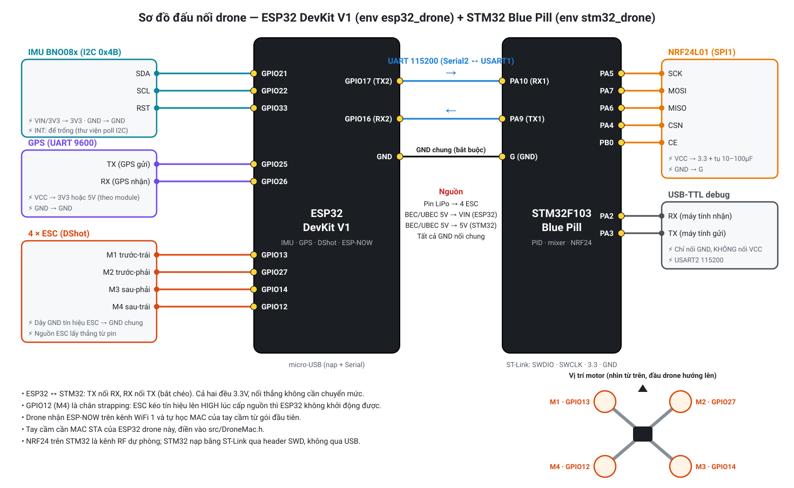

# Sơ đồ đấu nối drone

| Board | Env PlatformIO | Vai trò |
|---|---|---|
| ESP32 DevKit V1 | `esp32_drone` ([`src/main_esp32.cpp`](../src/main_esp32.cpp)) | Đọc IMU + GPS, nhận RC qua ESP-NOW, xuất DShot cho 4 ESC, gửi telemetry về tay cầm |
| STM32F103 Blue Pill | `stm32_drone` ([`src/main_stm32f103c8t6.cpp`](../src/main_stm32f103c8t6.cpp)) | PID + mixer, nhận RC dự phòng qua NRF24, trả MotorMix cho ESP32 qua UART |

## ESP32 DevKit V1

| Linh kiện | Chân linh kiện | GPIO | Ghi chú |
|---|---|---|---|
| IMU BNO08x (I2C, 0x4B) | SDA / SCL | 21 / 22 | VIN → 3V3. Module no-name màu tím: PS0/PS1 đã kéo xuống GND sẵn (I2C), ADO = HIGH (0x4B) |
| | RST | 33 | Reset cứng, code kéo RST trước khi khởi tạo (`BNO080_RST_PIN` trong `IMU.cpp`). INT để trống |
| GPS (9600 baud) | TX / RX | 25 / 26 | GPS TX → GPIO25 (RX của ESP32), GPS RX → GPIO26 |
| ESC M1 trước-trái | signal | 13 | DShot |
| ESC M2 trước-phải | signal | 27 | DShot |
| ESC M3 sau-phải | signal | 14 | DShot |
| ESC M4 sau-trái | signal | 12 | ⚠️ Strapping pin, xem lưu ý |
| STM32 | PA10 (RX1) | 17 (TX2) | UART 115200 |
| STM32 | PA9 (TX1) | 16 (RX2) | |
| STM32 | G | GND | Bắt buộc nối GND chung |

Thứ tự motor phải khớp mixer X-frame trong [`Flight.cpp`](../src/Flight/Flight.cpp) và [`Motor.cpp`](../src/Motor/Motor.cpp).

## STM32 Blue Pill

| Linh kiện | Chân linh kiện | Chân STM32 | Ghi chú |
|---|---|---|---|
| ESP32 | GPIO17 (TX2) / GPIO16 (RX2) | PA10 / PA9 | USART1 |
| NRF24L01 (SPI1) | SCK / MOSI / MISO | PA5 / PA7 / PA6 | VCC → 3.3, hàn tụ 10–100µF sát module |
| | CSN / CE | PA4 / PB0 | |
| USB-TTL debug | RX / TX | PA2 / PA3 | USART2 115200. Chỉ nối GND, không nối VCC |
| ST-Link | SWDIO / SWCLK / 3.3 / GND | header SWD | Dùng để nạp firmware |

## Nguồn

- Pin LiPo cấp thẳng cho 4 ESC.
- BEC/UBEC 5V cấp cho VIN của ESP32 và chân 5V của STM32.
- IMU, NRF24 lấy 3.3V từ board. GPS lấy 3V3 hoặc 5V tuỳ module.
- **Tất cả GND nối chung**, kể cả dây GND tín hiệu của ESC.

## Lưu ý

- **GPIO12 (M4) là chân strapping** của ESP32 (chọn điện áp flash). Nếu ESC kéo dây tín hiệu lên HIGH lúc cấp nguồn, ESP32 sẽ không khởi động được. Gặp lỗi này thì chuyển M4 sang chân khác (sửa `kMotorPins` trong `Motor.cpp`).
- Tay cầm gửi RC tới **MAC STA của ESP32 drone**, lấy từ `src/DroneMac.h` (file này chỉ nằm trên máy, mẫu ở `src/DroneMac.example.h`). Drone in MAC này ra Serial lúc khởi động, dòng `[DRONE] STA MAC:`.
- Drone tự học MAC của tay cầm từ gói RC đầu tiên, nên đổi tay cầm (ví dụ sang ESP32-S3) không cần sửa gì bên drone.
- Sơ đồ tay cầm: [CONTROLLER_WIRING.md](CONTROLLER_WIRING.md).
