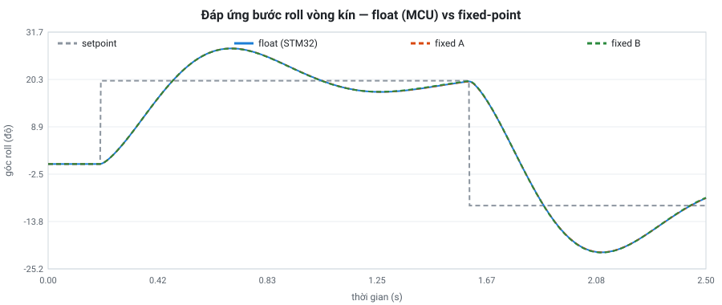

# Mô hình fixed-point bộ điều khiển PID — kết quả phân tích

Sinh bởi `ic/model/analyze.py`. dt = 2.5 ms (400 Hz), 7 kịch bản, 16000 chu kỳ.

Tiêu chí đạt: lệnh motor lệch so với bản float **≤ 1 µs** và **≤ 1.0%** số chu kỳ có lệch.

## 1. Quét từng tham số

Cấu hình gốc rộng rãi `fe=10 wk=18 fa=12 fd=8 fu=10 rnd=1`: lệch tối đa 1 µs, 0.619% chu kỳ lệch.

Giảm lần lượt **một** tham số, giữ các tham số khác như cấu hình gốc:

### `fe` — bit thập phân của góc/sai số

| giá trị | lệch max (µs) | % chu kỳ lệch | đạt |
|---|---|---|---|
| 1 | 10 | 70.787 | ❌ |
| 2 | 5 | 61.075 | ❌ |
| 3 | 3 | 39.800 | ❌ |
| 4 | 3 | 22.081 | ❌ |
| 5 | 3 | 11.781 | ❌ |
| 6 | 2 | 6.019 | ❌ |
| 7 | 2 | 2.975 | ❌ |
| 8 | 2 | 1.688 | ❌ |
| 9 | 1 | 0.944 | ✅ |
| 10 | 1 | 0.619 | ✅ |

### `wk` — bit mantissa hệ số

| giá trị | lệch max (µs) | % chu kỳ lệch | đạt |
|---|---|---|---|
| 6 | 3 | 19.156 | ❌ |
| 8 | 2 | 4.031 | ❌ |
| 10 | 1 | 1.269 | ❌ |
| 12 | 1 | 0.775 | ✅ |
| 14 | 1 | 0.594 | ✅ |
| 16 | 1 | 0.644 | ✅ |
| 18 | 1 | 0.619 | ✅ |

### `fa` — bit thập phân alpha

| giá trị | lệch max (µs) | % chu kỳ lệch | đạt |
|---|---|---|---|
| 3 | 299 | 55.969 | ❌ |
| 4 | 67 | 25.031 | ❌ |
| 5 | 67 | 25.031 | ❌ |
| 6 | 17 | 10.306 | ❌ |
| 7 | 17 | 10.306 | ❌ |
| 8 | 4 | 4.350 | ❌ |
| 9 | 4 | 4.350 | ❌ |
| 10 | 2 | 1.550 | ❌ |
| 11 | 2 | 1.550 | ❌ |
| 12 | 1 | 0.619 | ✅ |

### `fd` — bit thập phân thêm của bộ lọc D

| giá trị | lệch max (µs) | % chu kỳ lệch | đạt |
|---|---|---|---|
| 0 | 2 | 2.806 | ❌ |
| 1 | 1 | 1.600 | ❌ |
| 2 | 1 | 1.012 | ❌ |
| 3 | 1 | 0.806 | ✅ |
| 4 | 1 | 0.656 | ✅ |
| 5 | 1 | 0.662 | ✅ |
| 6 | 1 | 0.631 | ✅ |
| 7 | 1 | 0.644 | ✅ |
| 8 | 1 | 0.619 | ✅ |

### `fu` — bit thập phân tổng P+I+D

| giá trị | lệch max (µs) | % chu kỳ lệch | đạt |
|---|---|---|---|
| 0 | 4 | 64.919 | ❌ |
| 1 | 3 | 39.744 | ❌ |
| 2 | 3 | 22.569 | ❌ |
| 3 | 3 | 11.713 | ❌ |
| 4 | 2 | 6.013 | ❌ |
| 5 | 2 | 3.256 | ❌ |
| 6 | 2 | 1.788 | ❌ |
| 7 | 1 | 1.081 | ❌ |
| 8 | 1 | 0.731 | ✅ |
| 9 | 1 | 0.688 | ✅ |
| 10 | 1 | 0.619 | ✅ |

## 2. Cấu hình A — khớp thuật toán MCU

Ghép các mức tối thiểu ở mục 1 lại thì chưa đạt (sai số cộng dồn), nên tăng mỗi tham số thêm 1 bit:

**`fe=10 wk=13 fa=13 fd=4 fu=9 rnd=1`** → lệch tối đa **1 µs**, **0.706%** chu kỳ lệch, RMS 0.080 µs.

| kịch bản | chu kỳ | lệch max (µs) | % chu kỳ lệch |
|---|---|---|---|
| hover_gio_nhieu | 2400 | 1 | 0.583 |
| buoc_roll_pitch | 2400 | 1 | 0.708 |
| yaw_quay | 2400 | 1 | 0.208 |
| can_gat_ngau_nhien | 3200 | 1 | 0.656 |
| ket_bao_hoa | 1600 | 1 | 0.500 |
| ngau_nhien_toan_dai | 2000 | 1 | 1.900 |
| arm_disarm | 2000 | 1 | 0.500 |

Cùng cấu hình nhưng **cắt (floor) thay vì làm tròn** khi dịch phải: lệch tối đa 2 µs, 1.425% chu kỳ lệch (KHÔNG đạt). Làm tròn chỉ tốn thêm một bộ cộng hằng trước mỗi phép dịch.

Ngay cấu hình gốc dư bit cũng lệch 0.619% chu kỳ: đó là các lần giá trị PID nằm sát ranh giới số nguyên, phép cắt về 0 cho ra hai kết quả khác nhau 1 µs. Không thể khớp tuyệt đối với float, chỉ có thể khớp tới mức lệch 1 µs thỉnh thoảng.

## 3. Đề xuất: đổi alpha bộ lọc D thành số nhị phân

alpha = 0.2 không biểu diễn chính xác được ở hệ nhị phân nên cần fa ≥ 12 bit mới khớp MCU. Nếu đổi alpha trên **cả MCU lẫn chip** thành 0.203125 = 13/64 (bộ lọc gần như y hệt), số bit cần giảm hẳn:

| fa | lệch max (µs) | % chu kỳ lệch | đạt |
|---|---|---|---|
| 4 | 84 | 28.387 | ❌ |
| 5 | 84 | 28.387 | ❌ |
| 6 | 1 | 0.562 | ✅ |
| 7 | 1 | 0.562 | ✅ |
| 8 | 1 | 0.562 | ✅ |
| 9 | 1 | 0.562 | ✅ |

→ với alpha = 13/64, chỉ cần **fa = 6** (thay vì 13). Muốn áp dụng thì sửa `kDerivativeAlpha` trong `src/Flight/Flight.cpp` thành `13.0f / 64.0f` và bay thử lại.

## 4. Đánh đổi độ chính xác và diện tích

Tiêu chí "khớp MCU" rất khắt khe. Về mặt điều khiển, cái cần so là quỹ đạo bay: nhiễu góc của IMU khoảng 0.3° nên sai lệch nhỏ hơn nhiều so với mức đó là không phân biệt được khi bay.

| cấu hình | tham số | lệch max (µs) | % chu kỳ lệch | RMS (µs) | bước roll: lệch góc max | hover có gió: lệch góc RMS | bit e | bit tích lớn nhất | bit thanh ghi trạng thái (3 trục) |
|---|---|---|---|---|---|---|---|---|---|
| A — khớp MCU | `fe=10 wk=13 fa=13 fd=4 fu=9 rnd=1` | 1 | 0.71 | 0.080 | 0.0131° | 0.0084° | 23 | 40 | 234 |
| B — tiết kiệm | `fe=6 wk=10 fa=8 fd=2 fu=6 rnd=1` | 4 | 14.14 | 0.396 | 0.1104° | 0.0233° | 19 | 32 | 192 |
| C — tối giản | `fe=4 wk=8 fa=6 fd=1 fu=4 rnd=1` | 18 | 61.25 | 1.348 | 1.2363° | 0.1016° | 17 | 28 | 171 |

Thanh ghi trạng thái mỗi trục = tích phân + sai số trước + đạo hàm lọc.

- **B** lệch MCU ở nhiều chu kỳ hơn nhưng góc bay chỉ lệch tối đa 0.11°, nhỏ hơn nhiễu IMU: về điều khiển là tương đương, đổi lại tích nhỏ hơn 8 bit.
- **C** lệch tới 1.24° khi đổi setpoint: bắt đầu thấy khác biệt, không nên dùng.
- Chọn A hay B là quyết định thiết kế của nhóm: A dễ chứng minh "chip = thuật toán đã bay thử", B tiết kiệm diện tích/công suất.

## 5. Hệ số sau lượng tử hoá (cấu hình A)

Hệ số đã gộp dt và hệ số 3: KP' = 3·kp, KI' = 3·ki·dt, KD' = 3·kd/dt. Giá trị = mantissa / 2^shift.

| trục | hệ số | giá trị thật | mantissa | shift | giá trị lượng tử | sai số |
|---|---|---|---|---|---|---|
| roll | KP' | 1.8 | 7373 | 12 | 1.80005 | +0.003% |
| roll | KI' | 0.0003 | 5033 | 24 | 0.00029999 | -0.003% |
| roll | KD' | 36 | 4608 | 7 | 36 | +0.000% |
| pitch | KP' | 1.83 | 7496 | 12 | 1.83008 | +0.004% |
| pitch | KI' | 0.0003075 | 5159 | 24 | 0.0003075 | +0.000% |
| pitch | KD' | 36 | 4608 | 7 | 36 | +0.000% |
| yaw | KP' | 3.9 | 7987 | 11 | 3.8999 | -0.003% |
| yaw | KI' | 0 | 0 | 0 | 0 | — |
| yaw | KD' | 0 | 0 | 0 | 0 | — |

- alpha bộ lọc D: 0.2 → 1638/2^13 = 0.19995
- Giới hạn tích phân: |A| ≤ 100.0/dt = 40000 → 40960000 (Q.10)
- Ngưỡng bão hoà: |u'| ≤ 250 → 128000 (Q.9)

## 6. Độ rộng bit datapath (cấu hình A, có dấu)

Trường hợp xấu nhất tính từ phạm vi đầu vào (góc ±180°, gyro ±2000°/s, setpoint tối đa); RTL phải dùng **ít nhất** cột này để không bao giờ tràn số.

| tín hiệu | xấu nhất (bit) | quan sát trong mô phỏng (bit) |
|---|---|---|
| e (sai so) | 23 | 23 |
| acc (tich phan) | 27 | 27 |
| de (hieu sai so) | 28 | 28 |
| dfilt (dao ham loc) | 28 | 25 |
| tich bo loc (de-dfilt)*alpha | 39 | — |
| tich he so x du lieu | 40 | 39 |
| u' = P+I+D | 28 | 24 |

Đầu vào chip: góc/tốc độ góc/setpoint dạng Q.10 có dấu, 23 bit đủ cho ±2350 (sai số yaw lớn nhất).

## 7. Vòng kín

Đáp ứng bước roll (0 → 20° → −10°) trên mô hình drone đơn giản (mỗi trục là vật quay có cản). Ba đường gần như trùng nhau.

## 8. Golden vectors cho RTL (cấu hình A)

`golden_vectors.csv`: 16000 chu kỳ, đầu vào đã ở dạng số nguyên Q.10 và đầu ra mong đợi (mix 3 trục + 4 motor) tính bằng mô hình fixed-point. Testbench RTL đọc file này, đưa đầu vào vào chip từng chu kỳ và so sánh **bit-exact** với đầu ra. Trạng thái PID reset về 0 ở đầu mỗi kịch bản.

`coeffs.txt`: mantissa/shift của hệ số và các hằng số, dùng làm tham số cho RTL.
